# Mask_R_CNN_Instance_Segmentation
Masking people that are present in an image.

## Project Objective
The quality of dataset you choose can either make or break your model. When working with images in artificial intelligence, a mask is made of the image which outlines the shape of the feature being classified in the picture. This step in the computer vision process is called image segmentation and can be the most labor intensive part of data labeling before processing images through a model.  The goal of image segmentation is to recognize and understand what is in the image at the pixel level. Each pixel in an image belongs to a single class. This differs from object detection where bounding boxes are drawn around the object, which can overlap. This level of detail is useful to definitively know if an object of interest is in the image or not, and what is in the image that is not an object of interest. This project will take a folder of images, create masks for each person found in each image, train the model, and evaluate the model on a sample image. 

## Environment
-CUDA 12.0
-Python 3.8.10
-Jupyter Notebook

## Data
The dataset for this project comes from the MIT Datacenter Challenge, and includes approximately 2TB of images. The full dataset can be found at https://dcc.mit.edu/data.

## Model
Mask R-CNN Predictor pre-trained model from PyTorch. 

## Original Image 
The original image used to test out the model and the corresponding masks of people present in the image are displayed. 

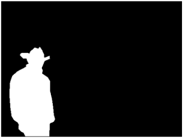

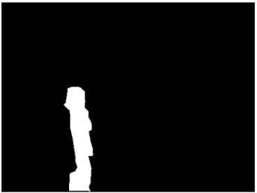

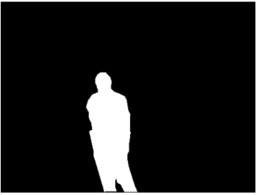

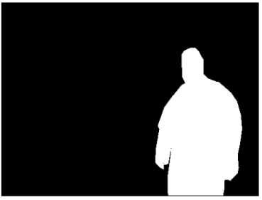

## Model Training
The model was trained over 100 eopchs and the training loss was visualized in a line graph. 

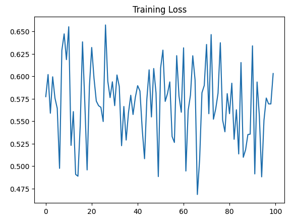

## Model Evaluation
The model was given an image to evaluate the accuracy of the masking. The prediction score for each mask is displayed at the top of each masked image. 

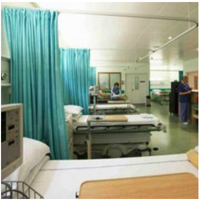

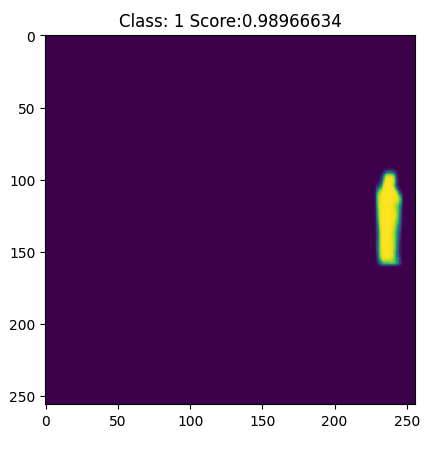

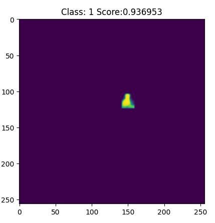

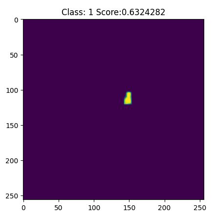

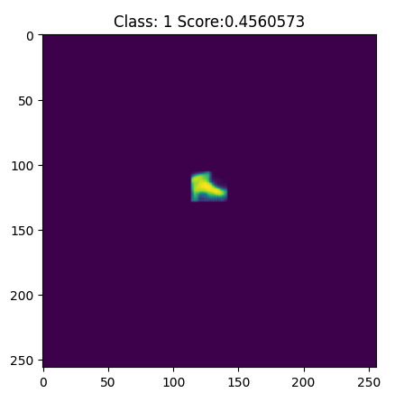

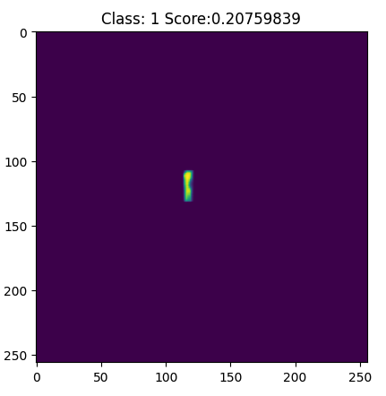

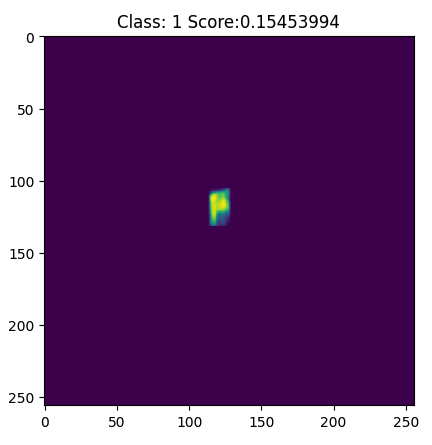

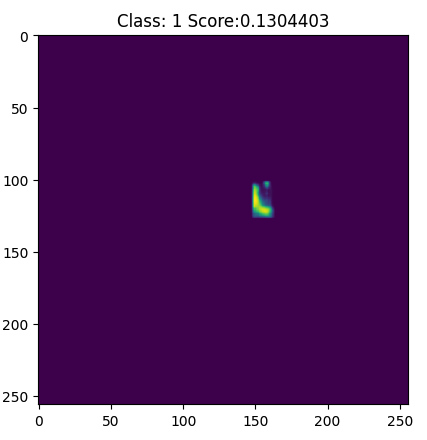

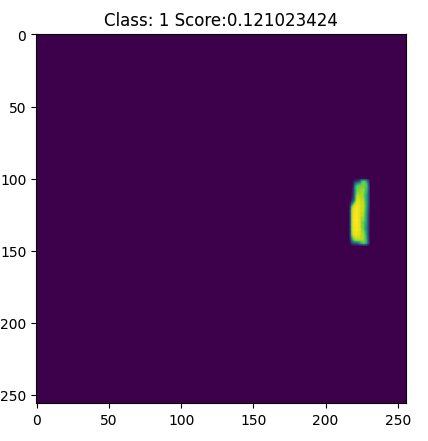

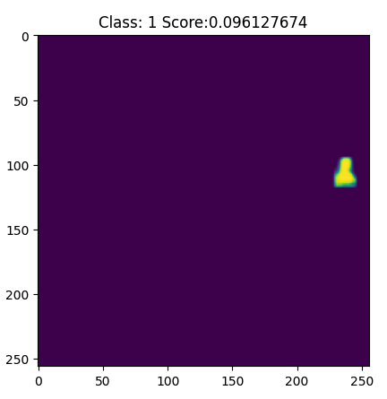

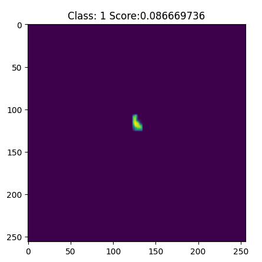

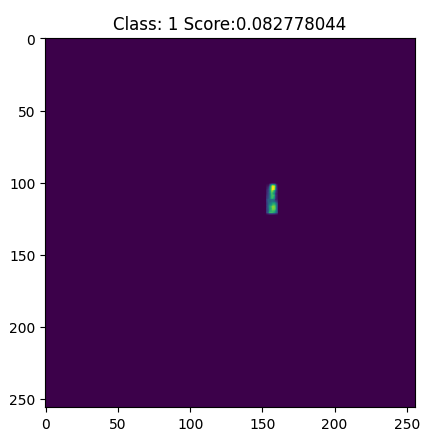

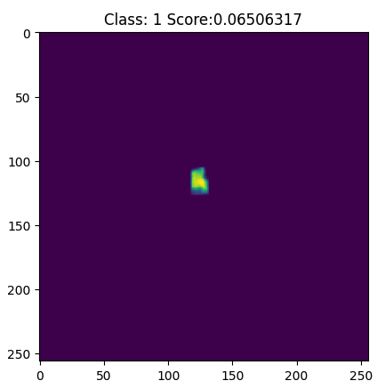

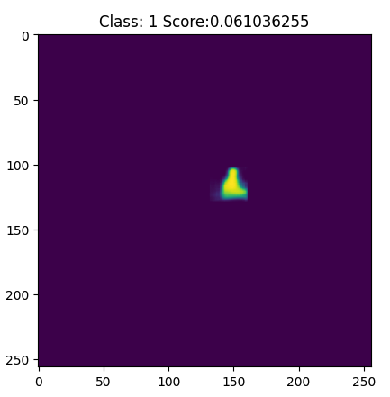

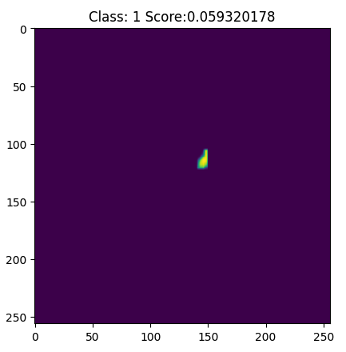
